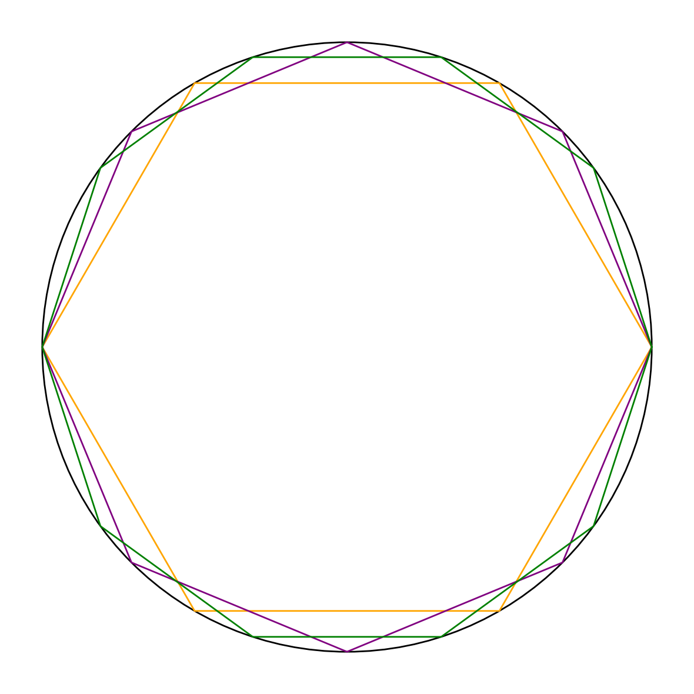

The Hidden Variable
And the not so subtle art of Physics

It was the Greeks (and possibly others) that defined God as the First Mover.

If all things are in flux, there must have been a first mover they argued.

And this first mover, must not be moved by anything else, otherwise that cause would be the First Mover and so on.

Physics later discovered that non-uniformity developed, otherwise, there wouldn’t be clusters in the universe of Galaxies that we see today.

Then Johann von Neumann said “The Hidden Variable” meaning if we only had all the knowledge of every variable, we could then “predict” the state of the Universe.

You see, they were all saying the same thing. All of them were trying to understand the Universe as we know it.

They asked very simple questions like you and me as we look out at the waves: “What makes you move?”

It is the same question as to why man walks: “What makes you move?”

And then, they went a step further than that.

“If I know what makes you move, then I can exactly predict where you will go.”

So Newton created Classical Mechanics, to properly model Planets, and predict where they will go.

We can go even a step further and refine the cause of the movement to “mass”. It seemed depending on the mass, the way an object attracts another can be figured out. So they refined this, and said without a doubt, it seems ‘mass’ is the cause of movement.

As time went on, they realized Gravity wasn’t the only force that caused movement. They realized there are other forces. Like electro-magnetism.

All these discoveries, their definitions, and the formulas that model their interactions bred many Nobel Prizes.

This was all written by hand, without the help of AI or GPTs.

My point is, go ahead and make an AI Agent at https://thaly.ai,

and while your at it, clear out your email inbox with https://zeroinbox.ai

#emailai

#zeroinbox

#inboxzero

#emailcleaner

#emailmanager

#emailorganizer

#aiEmailCleaner

#aiEmailManager

#aiEmailOrganizer

#ycombinator

#yc

Funny story about YC. Every single YC application i've sent in has been rejected. Only one succeeded and we made it to the interview stage. I believe it was my fault we never made it to the end (not any of my co-founders). Anywho, every single rejection, I ended up coding faster, and harder to prove them wrong. Here's to another year, another YC application.

#ThalyAI

#salesai

#aiagents

#agenticthis

#agenticthat

#TalkToMyAgent

👇 Please subscribe to my Youtube below:

http://youtube.com/@shayanarman