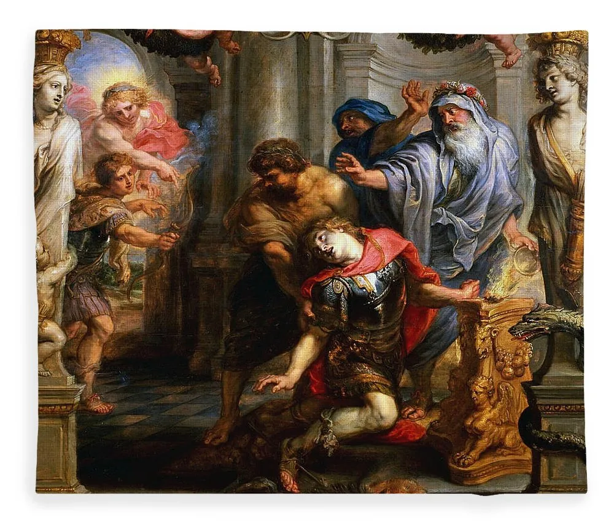
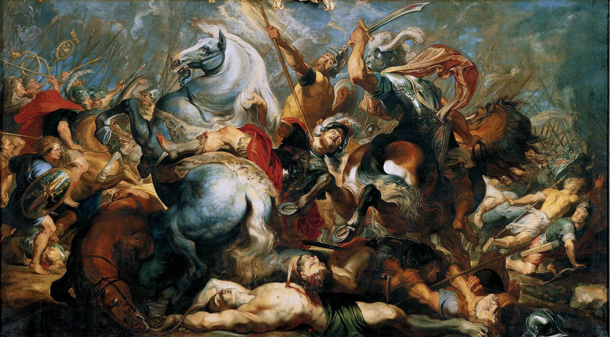

On Work
and the Art of Consumption

For years I looked down on work. I called the comings and goings of people Crazy.

Without the reason to work, it seems utterly ridiculous. Like the comings and goings of the planets, without a mind to assign meaning. They are just moving. A grey world of mechanics.

*The Death of Achilles, Rubens*

The Death of Achilles, Rubens

The Death of Achilles, Rubens

And then I went fully Broke.

And then I visited my own family and saw hardship.

And then I found meaning.

And work all of a sudden had absolutely nothing to do with work.

But everything to do with meaning, life, and love.

At that point I understood that we work not for work’s sake. But life building. Work is about Life. Without work, there is no Life.

As the Bible says, they were condemned to work for eternity.
The definition of work is simply the expenditure of energy to produce some outcome. But work in the modern sense is to expend energy to gain money. Usually, in western countries, working for a boss to gain a Paycheque. Sometimes delayed 2 weeks in some cruel fashion.

Despite the obvious grossness of this process, there is beauty in the common Labourer. The Reason of his typing, grinding, waking up early, preparing his shitty meals for the week, is not → output.

No. It is the life that the labourer is working for. For poverty, homelessness, is a line we must all draw in the proverbial sand of our own minds and lives.

We all have a line, a point so low we refuse to enter.

I’m willing to not buy new clothes every week, but I’m not willing to only eat Oatmeal.
For you could. That could be the life you live. But you refuse, and therefore have to work.

Thereafter it is proven that work beyond basic sustenance is the process of life building.

We decide on the life we wish to sustain, and then we must go out and sustain it.

Therefore, mathematically, the trap is the life we choose. If it is too far above our heads, the work required is more and more suffocating.

Elon Musk wants to go to Mars. He must work… endlessly.

The labours of Men are thereafter the energy expenditure to create the Life they envision. This is the Life the Man desires.

The next component of the life a Man lives is the Addiction Tax that the Man must pay into - sometimes daily, usually weekly. Like a cancerous ulcer, Alchoholism consumes the Man’s resources, and some of his work goes to paying for the sad ulcer living inside his own mind and heart.

Fight it, or it will consume you, and ultimately you will meet your end.

*Fight it, or it will consume you, and ultimately you will meet your end.*

Some of the Addiction Ulcer is contained physically, in the form of “hardware-neural programming”. But another way to describe this is Spiritual-Emotional. If you’ve ever felt incredibly-fully-connected, you know you desire nothing. Which is described again Logically-Ontologically as the Wise Man who ‘gives up everything’, as he has found God, and therefore now requires nothing. Many of our stories have Infinite-Value (definition found below article) wisdom contained in them. Another story is the meditation stoic who lives only on a Date, as his Spirit provides the rest. This is the opposite of the Ulcer which consumes resources, as the Spirit fills him with Love, wherein he is actually “Full” and requires less. His Energy Consumption is Then Less. And his “Work to sustain this consumption” is Descreased. In the Form of a smaller car, less expensive house, and simpler vacations. The wise man requires less.

Let us Break down the process of Energy Consumption in the Common Labourer

“1/3 of his Labour therefore goes to sustaining the body,

1/3 goes to Taxes - addiction in the form of Alchohol.

a small portion goes towards the life he is building.”

This process eventually kills him in the form of disease.

I hope you decide to subscribe to this Newsletter, as I love writing Philosophy in the form of Mathematical Logic.

Thank you again for your support even as a Reader,
As it gives me joy to write to you.

All the best and I wish you luck in your Labours,

Shayan Arman

Definitions:

«Infinite-Value wisdom means the value we gain from a Grain of Wisdom, is worth a Mountain in Gold. For the Gold can be spent in a day, but the wisdom can make a handful of Gold last a lifetime.»
