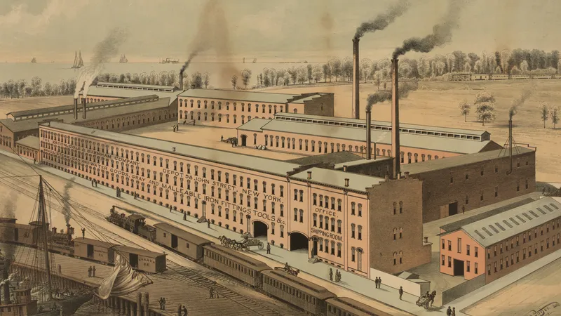

On Upward Mobility
and the evasion of Capital

This might be my favourite post I’ve ever written.

If you’ve ever tried to raise money for a project,

you will soon realize the reason why its called Capitalism, and why the rich stay rich.

The deluge of questions,

usually rapid fire by semi-autistic types, will quickly wake you up to the reality of this world.

*Industrialization changed things.. just kidding it only switched them around.*

Money is hard to come by.

Sure there’s tons of it now going around the world.

But with Treasury Bills, Dividend Paying stocks, everybody would much rather have it sit there, gaining a decent interest, than give it to your pie in the sky idea. If there is a lack of good ideas that produce better returns of course.

So then where do you start?

Most education expects that you already have Capital.

*Adam Smith on the beauty of Capital allocation worldwide (wealth of nations)!*

Business Management degrees manage businesses that have already been built.

Very few people teach absolute broke people with no funds.

Usually these people are hustlers, teaching means to get rich quick.

Almost always in illegal ways.

From a Mathematical Logic perspective, illegal means produce wealth quicker because they are so risky. So the payoff is huge. But of course if you get bit… There’s a hilarious story of a tiny village in the mountains of the Middle East (I won’t say where). They became rich off making little Scientific Experiments in their garages. One guy got so loaded, he bought 3 Porches and a Dolphin. No joke. The government soon found out about it, and started making it themselves!

So then what’s the way to sidestep this?

Or what has been the way in the past?

Education. Knowledge.

For you to build something of value, and then sell it, will take money. Even a simple pizza shop takes money. Equipment, marketing, supplies, workers, website. All of that takes money. And nobody wants to give it to you.

But knowledge? You can gain knowledge for nearly free.

And that’s why your parents told you to study.

It is / was the most surefire way of climbing the ladder, and becoming upwardly mobile.

And for some crazy reasons, software as well. Since the cost of compute has gone down, at least the build phase can be accomplished cheaply if its just you programming. You will still hit the marketing wall, but you might get around that with creative means. At the very least with software, you can build something with just your hands. While everything else requires material to get started.

Until very recently, Software met the Capital creation and Knowledge accumulation rules. Meaning not only could you sell your labor for a higher value with software. But you could also create capital with software. Crazy.

I guess that’s why the big guys at the top had to create an AI that could write code. We can’t let the poor get too excited!
